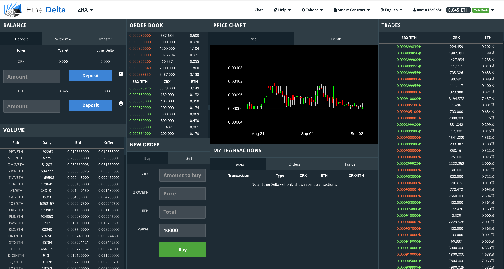

# EtherDelta GDAX-like Theme Extension

> A [Chrome Extension](https://chrome.google.com/webstore/detail/etherdelta-gdax-theme/eohjjifkbgfaolkejekjjgbchhdnflij) that enables a [GDAX](https://www.gdax.com/trade/ETH-USD)-like theme for [EtherDelta](https://etherdelta.github.io).

# Install

Extension available on the Chrome Web Store

[https://chrome.google.com/webstore/detail/etherdelta-gdax-theme/eohjjifkbgfaolkejekjjgbchhdnflij](https://chrome.google.com/webstore/detail/etherdelta-gdax-theme/eohjjifkbgfaolkejekjjgbchhdnflij)

# FAQ

- Q: Does this Chrome Extension execute JavaScript?

  - A: There is no JavaScript execution at all. Only the CSS stylesheet is inserted into the page.

- Q: Can this extension access my private key?

  - A: No it can't because there is no JavaScript being executed.

- Q: I don't believe you.

  - A: Take a look at the source code using a tool such as [Chrome extension source viewer](https://chrome.google.com/webstore/detail/chrome-extension-source-v/jifpbeccnghkjeaalbbjmodiffmgedin?hl=en) and inspect the contents. You can also look at the content of this repository and install it manually.

- Q: How can I install it directly from this repository?

  - A: Dowload this repo, and compress (zip) the contents of the `extension` folder. Then go `chrome://extensions` in the URL bar and click on "Load unpacked extension...". Select the compressed folder.

- Q: When is the theme stylesheet inserted into the page?

  - A: The theme stylesheet is inserted on page load.

- Q. When is the Chome extension activated?

  - A: The Chrome Extension is only activated on the [etherdelta.github.io](https://etherdelta.github.io/) or [etherdelta.com](https://etherdelta.com/) domain.

# License

MIT
